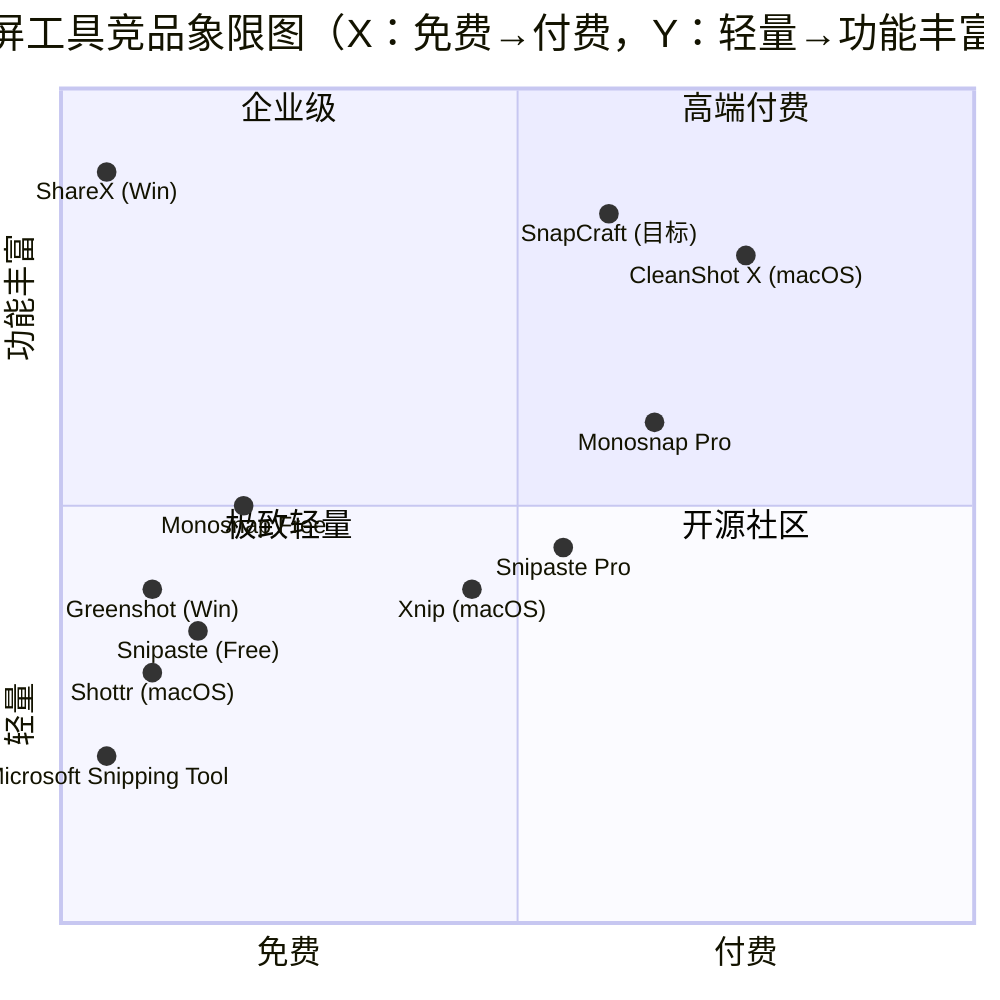

# SnapCraft 跨平台上架完整 PRD
## macOS App Store + Microsoft Store 合规 + Windows 全功能移植

> **文档版本**:v1.0
> **撰写日期**:2026-07-18
> **作者**:Alice（Product Manager）
> **文档状态**:Draft — 待团队评审
> **目标读者**:架构师 / 平台工程师 / 设计师 / QA

---

## 0. 文档元信息

| 项目 | 值 |
|------|------|
| 项目根 | `/Users/liwenchao/GithubProSpace/snap-craft` |
| 技术栈 | Tauri 2 (Rust 2.11) + React 18 + Vite 6 + TypeScript 5.6 |
| 现有平台 | macOS 14+（已生产可用） |
| 目标平台 | macOS 14+（保留并上架 App Store）+ Windows 10 1809+ / Windows 11（移植并上架 Microsoft Store） |
| 工期预算 | 8-12 周，4 个 milestone |
| 文档语言 | 简体中文 |
| 输出文件 | `/Users/liwenchao/GithubProSpace/snap-craft/_prd_store_compliance.md` |

---

## 1. 产品目标

**一句话产品定位**:SnapCraft 是面向"重度文档创作者 + 隐私敏感用户 + AI 优先团队"的**跨平台智能截屏 + AI 文档助理**一体化工具,通过原生系统 API + 内置 AI 工作流 + 强编辑器,把"截图 → 标注 → OCR → AI 二次加工 → 文档落地"整条链路压缩在 5 秒内,不做花哨营销、坚持纯本地优先 + 零遥测。

**跨平台目标**:在 macOS 已有的功能矩阵(全屏/区域/窗口/滚动长图/钉图/标注/历史/AI 面板/编辑导出)零回归的前提下,把这套体系**完整移植到 Windows 10/11**,并让两端分别通过 **macOS App Store** 与 **Microsoft Store** 严苛审核上架。

**商业目标**:
- **商业化主轴**:首年通过 App Store + Microsoft Store 双渠道覆盖全球桌面端创作者,**首年下载量目标 10 万**(macOS 6 万 + Windows 4 万)。
- **付费策略**:macOS 一次性买断制(App Store $9.99,已购用户免费升级);Windows 同步买断($9.99),30 天试用版可下载试用版(无 AI + 截屏加水印)。**不在 1.0 版做订阅制**,先验证产品力。
- **核心壁垒**:三件事别人抄不动——(1) AI 助手跨截图历史库的持久化记忆;(2) 编辑器 + AI 工具调用的实时循环;(3) macOS TCC + 沙箱 + 公证 + Windows MSIX 签名整套合规的工程沉淀。
- **长期愿景**:从"截图工具"演进为"个人视觉知识工作台",2-3 年内成为 Snipaste + Notion AI 的中间形态。

---

## 2. 用户故事(8 个核心场景)

> 每条用标准格式:**As a [role], I want [feature] so that [benefit]**。

### US-1:macOS 截屏老用户
**As a** macOS 重度截屏用户(产品经理 / 设计师 / 运营),
**I want** 在 macOS App Store 直接搜索下载 SnapCraft,授权后立即能用 ⌘⇧2 区域截图、⏱ 延时、📌 钉图、✏ 标注、保存到 ~/Downloads,**without** 任何"未知开发者"弹窗或额外终端操作,
**so that** 我可以无障碍从 CleanShot X / Shottr 平滑迁移,且不丢失任何已有习惯(全局快捷键、托盘菜单、HiDPI 精度、AI 助手)。

### US-2:Windows 端首次接触
**As a** Windows 11 用户(开发工程师 / 学生),
**I want** 从 Microsoft Store 安装 SnapCraft,启动后用 Ctrl+Shift+2 框选区域,自动复制到剪贴板,标注后一键保存为 PNG/PDF,
**so that** 我在 Windows 上能获得与 macOS 端同等的"零学习成本"截屏体验,不需要安装额外运行库(VC++ / WebView2 安装由 Tauri/MSIX 自动处理)。

### US-3:AI 文档创作者
**As a** 技术博客作者 / 公众号编辑,
**I want** 在截屏后一键让 AI 助手基于"最近 10 张相关截图"生成图文报告(可选择 Markdown / DOCX / PPTX / XLSX / HTML / PDF 六种输出),
**so that** 我可以把"截 5 张界面图 + 写 2000 字说明"这类工作从 30 分钟压缩到 90 秒,且 AI 引用了我过往截过的相似截图(记忆库能力)。

### US-4:编辑器重度用户
**As a** UI 设计师 / 教程作者,
**I want** 标注工具栏具备矩形/箭头/马赛克/模糊/序号/文字/选区 OCR 等全部工具,支持无限撤销/重做 + 图层管理,
**so that** 我可以在不离开 SnapCraft 的情况下完成"截屏 + 打码 + 标号 + 文字说明"一站式操作,不需要切到 Photoshop / 马克鳗。

### US-5:隐私敏感用户
**As a** 法务 / 合规 / 安全研究员,
**I want** 确认 SnapCraft **不联网**、**不上传截图**、**不写入遥测**、**AI 助手默认直连我自配的 API 端点**、**所有历史数据存本地**,
**so that** 我可以放心截取含敏感信息的屏幕内容,而不用担心任何中间环节泄露。

### US-6:出海用户(海外/英文环境)
**As a** 在英文 / 日文 / 西语环境下工作的非中文母语用户,
**I want** SnapCraft 的全部文案、菜单、按钮、错误提示、文档、官网、App Store 描述都**至少中英双语**,
**so that** 我可以零障碍理解每一个功能,且 AI 助手可以接收多语言输入并给出多语言输出。

### US-7:多屏重度用户
**As a** 三屏 / 四屏工作站用户(金融交易员 / 视频剪辑师),
**I want** 截图前能看到所有显示器的缩略图 + 主副屏标识 + 物理坐标(全局坐标系),跨屏框选能精准拼接成一张完整大图,
**so that** 我可以一次截到"4K 主屏 + 竖屏副屏 + 笔记本内屏"的整张全景。

### US-8:录屏与长截图用户
**As a** 在线教育讲师 / Bug 复现工程师,
**I want** 录屏功能可以录制屏幕 1080p 30fps,支持音频(麦克风/系统声)、可暂停/继续、结束后自动调出编辑器(可裁剪掉开头/结尾的多余片段),
**so that** 我可以在不安装 OBS 的情况下完成"复现 bug + 录视频 + 截关键帧 + 标注文档"完整工作流。

---

## 3. 需求池(按 P0/P1/P2 排序)

### 3.1 P0(必须做,MVP 上架)

#### 3.1.1 macOS 端合规上架

| ID | 需求 | 验收标准 |
|------|------|----------|
| REQ-M-001 | **App Sandbox 已启用** | `Entitlements.plist` 包含 `com.apple.security.app-sandbox = true`,且 `tauri.conf.json` 的 `bundle.macOS.signingIdentity` 切到正式 Apple Developer ID |
| REQ-M-002 | **App Sandbox 截屏改 CoreGraphics** | 不再依赖 `screencapture` CLI,改用 `CGDisplayCreateImage` / `CGWindowListCreateImage`(已在 `_audit_core.md` 中明确——此为已完成的改造,仅需保留) |
| REQ-M-003 | **Hardened Runtime 启用** | `tauri build` 输出包含 `--options runtime`,二进制通过 `codesign -dv --options=runtime` 验证 |
| REQ-M-004 | **公证(Notarization)** | `xcrun notarytool submit --wait` 通过,上传到 App Store Connect 时 `appStoreConnectAPIKey` 已配置 |
| REQ-M-005 | **App Store Connect 元数据** | 1024×1024 app icon(已在 icons/)+ 2880×1800 截图 5 张(macOS mdpi Retina 13" 标准) + 描述 / 关键词 / 隐私政策 URL / EULA |
| REQ-M-006 | **PrivacyInfo.xcprivacy 隐私清单** | 2025-05-01 后 Apple 强制要求,声明 API 用途(UserDefaults / SystemBootTime / DiskSpace / FileTimestamp 等等) |
| REQ-M-007 | **TCC 屏幕录制权限文案** | `Info.plist` 的 `NSScreenCaptureUsageDescription` 文案已多语言化(en/zh-CN/zh-TW/ja/de/es),符合 Apple HIG |
| REQ-M-008 | **App Store 审核合规** | 不调用私有 API(目前 screencapture 私有调用已全部移除);不在 LaunchAtLogin 上做静默自启;不读取用户剪贴板无授权(目前 arboard 需 user-selected.read-write,合规) |
| REQ-M-009 | **macOS 版本与机型支持** | Info.plist 声明 `LSMinimumSystemVersion = 14.0`,支持 Apple Silicon + Intel(双架构包上传) |

#### 3.1.2 Windows 端全功能移植

| ID | 需求 | 验收标准 |
|------|------|----------|
| REQ-W-001 | **Windows 截屏核心实现** | 通过 `xcap` crate(已在 Cargo.toml)封装 DXGI Desktop Duplication API 实现全屏/区域/窗口截图,与 macOS 端 `commands::capture` 同一接口签名 |
| REQ-W-002 | **Windows 多屏枚举** | 使用 `EnumDisplayMonitors` + `DISPLAY_DEVICE` 枚举所有显示器,返回结构与 macOS 的 `DisplayInfo` 完全一致(同字段名 + 物理像素 + scale + 主屏标识 + 全局坐标) |
| REQ-W-003 | **Windows 窗口枚举** | 使用 `EnumWindows` + `GetWindowText` + `GetWindowThreadProcessId` 枚举所有可见窗口,前端选择覆盖层与 macOS 端 UX 一致 |
| REQ-W-004 | **HiDPI / 多 DPI 缩放适配** | Windows 多屏不同 DPI 缩放(150% / 200% 混用)下,坐标转换正确,截图不偏移、不模糊 |
| REQ-W-005 | **MSIX 打包配置** | `tauri.microsoftstore.conf.json` 已存在(已建空骨架),需填充 `publisher` / `publisherDisplayName` / `identity.name` 等字段;WiX / MSIX bundle 模板生成 |
| REQ-W-006 | **Windows 代码签名** | 使用 EV 证书(预计 $300-700/年) + SignTool 对 `snap-craft.exe` + MSIX 进行双重签名,避免 SmartScreen 警告 |
| REQ-W-007 | **WebView2 运行时依赖** | MSIX bundle 内置 `MicrosoftEdgeWebview2Setup.exe` 离线安装包,首次启动自动检测,缺失则引导安装 |
| REQ-W-008 | **Windows 通知中心集成** | 全局快捷键 + 截图完成 + 录屏完成,通过 Windows Toast Notification 提醒 |
| REQ-W-009 | **Windows 文件路径适配** | `tauri::api::path::app_data_dir` 返回 `%LOCALAPPDATA%\com.snapcraft.app\`,历史/配置/logs 全部存此 |
| REQ-W-010 | **Windows 托盘菜单** | `tauri::tray::TrayIconBuilder` 已实现(跨平台),Windows 端右键菜单功能与 macOS 一致 |
| REQ-W-011 | **Windows 全局快捷键** | 用 `RegisterHotKey` (Win32 API) 注册 Ctrl+Shift+1/2/3/4,功能与 macOS ⌘⇧1/2/3/4 完全等价 |
| REQ-W-012 | **Windows OCR 集成** | `windows-rs` + `Windows.Media.Ocr` WinRT API(已在 Cargo.toml 注释中规划),首次启动时检测语言包,缺失则引导用户从 Microsoft Store 安装 |
| REQ-W-013 | **跨平台平台抽象层** | Rust 端新增 `platform/` 目录,按 `#[cfg(target_os = "macos")]` / `#[cfg(target_os = "windows")]` 分发,前端调用 `get_platform()` 即可获知,所有 `commands::capture::*` 签名保持不变 |

#### 3.1.3 共享工程需求

| ID | 需求 | 验收标准 |
|------|------|----------|
| REQ-S-001 | **平台抽象 trait** | Rust 端定义 `trait PlatformCapture` / `trait PlatformDisplay` / `trait PlatformWindow` / `trait PlatformOcr`,macOS 与 Windows 各实现一份,通过 `cfg` 分发 |
| REQ-S-002 | **feature flag** | `Cargo.toml` 新增 `macos` / `windows` default features,允许单独编译验证 |
| REQ-S-003 | **统一错误码体系** | 定义 `enum SnapError { PermissionDenied, NoDisplay, CaptureFailed, OcrUnavailable, ... }`,前端根据 code 弹不同文案 |
| REQ-S-004 | **跨平台诊断收集** | `clog!` 宏已存在,Windows 端 `%LOCALAPPDATA%\com.snapcraft.app\logs\dev.log` 输出 |
| REQ-S-005 | **i18n 全文案** | 至少完成 en-US / zh-CN 两种语言,所有用户可见文案走 `i18n.t('key')`,不允许硬编码 |
| REQ-S-006 | **AI 助手模块零改动** | `src/features/ai/` 保持纯前端,不做任何平台特定代码注入;Windows 上可继续直连大模型 API |
| REQ-S-007 | **macOS 已有功能零回归** | 截图 / TCC / 签名持久化 / HiDPI / AI 面板 / 编辑器 / 滚动长图 / 钉图全部保留,且通过 `clog!` 回归测试套件验证 |

---

### 3.2 P1(强烈建议,第二批迭代)

| ID | 需求 | 验收标准 |
|------|------|----------|
| REQ-101 | **Windows 录屏** | 通过 Media Foundation + Windows.Graphics.Capture API 实现 1080p 30fps 录屏,支持音频输入(麦克风/系统声) |
| REQ-102 | **macOS 录屏增强** | 当前 macOS 录屏已实现,需补:支持选区录屏、可暂停/继续、结束时自动弹出编辑器 |
| REQ-103 | **应用内自动更新** | macOS 端集成 Sparkle 2.x(开源 App Store 替代方案,但 App Store 版用 StoreKit 内置更新);Windows 端 Squirrel.Windows 增量更新 |
| REQ-104 | **跨平台快捷键自定义 UI** | 当前全局快捷键硬编码,需补:设置页允许用户自定义 ⌘/Ctrl + 任意键 |
| REQ-105 | **多显示器缩略图选择器** | macOS 端已有,Windows 端需补:使用 DXGI Output Duplication 实时取每屏缩略图 |
| REQ-106 | **Windows 通知中心(完整)** | 录屏开始/结束/截图完成/AI 任务完成 全部走 Toast Notification,支持 Action Center 历史查看 |
| REQ-107 | **错误码 + 日志上报(可选)** | 用户主动点"反馈问题"时,把 logs/dev.log 打包成 zip,通过邮件附件发回(默认关闭,需用户主动授权) |
| REQ-108 | **macOS 多语言扩展** | 至少覆盖 6 种语言:en-US, zh-CN, zh-TW, ja, de, es |
| REQ-109 | **滚动长截图 Windows 适配** | macOS 端已实现半自动滚动长图,Windows 端需补:基于 `PrintWindow` 反复抓取 + 模板匹配对齐 |
| REQ-110 | **历史记录云同步(iCloud / OneDrive)** | 用户主动开启后,history.json 加密后上传(仅用户自己可解密),跨设备同步 |

---

### 3.3 P2(远期)

| ID | 需求 | 验收标准 |
|------|------|----------|
| REQ-201 | **Linux 移植** | Ubuntu 22.04+ / Fedora 38+,通过 X11 + xcap + wlroots + PipeWire 实现基础截屏 |
| REQ-202 | **iOS / iPadOS 移植** | 利用现有 Tauri Mobile 工具链,但需要完全重写 UI(触屏 + 选区手势) |
| REQ-203 | **Web 版本(浏览器扩展)** | Chrome / Edge / Firefox 扩展,基于 WASM 复用部分 Rust 截屏逻辑 |
| REQ-204 | **团队协作版本** | 截图 + 标注实时协作(CRDT),AI 助手共享历史库 |
| REQ-205 | **macOS Vision Pro / visionOS 移植** | 利用 visionOS 截屏 + 空间标注 |
| REQ-206 | **AI 助手本地模型(Whisper / Llama)** | 完全离线场景下,可加载本地 GGUF 模型进行 OCR + 文本生成 |
| REQ-207 | **手势 / Touch Bar 支持** | MacBook Touch Bar 自定义按钮,Surface Dial 旋转控制 |
| REQ-208 | **插件系统** | 第三方开发者可写 .scplugin 扩展标注工具与 AI 预设 |

---

## 4. 竞品分析(7 个产品,必含 Mermaid 象限图)

### 4.1 竞品速览表

| 产品 | 平台 | 定价 | 核心卖点 | 劣势 | 对 SnapCraft 的启示 |
|------|------|------|----------|------|---------------------|
| **Snipaste** | Win/macOS/Linux | 免费 / 付费解锁高级功能($10) | 极致轻量、纯本地、贴图工作流、F1 截图、标注极快 | 缺乏 AI 能力、UI 偏朴素、Mac 端不维护活跃度低 | "轻量 + 贴图 + 纯本地" 是用户迁移过来的硬需求,SnapCraft 必须保留极简标注 UX |
| **ShareX** | Windows 独占 | 免费开源(GPL) | 功能最全:截屏/录屏/文件上传/OCR/工作流自动化 100+ 动作 | 界面复杂、设置项爆炸、Mac 用户无缘、臃肿(200+ MB) | 警惕"功能堆叠"反噬,保持 UI 克制;自动化工作流可在 P2 阶段借鉴 |
| **CleanShot X** | macOS 独占 | $29 买断(年付 $9.99 更新) | 录屏+GIF+滚动截图+截图预设+macOS 深度集成 | 不跨平台、无 AI、依赖系统 QuickTime 录屏 | macOS 录屏体验的天花板,SnapCraft 在 Windows 上必须做到它做不到的事——跨平台 |
| **Xnip** | macOS 独占 | ¥30 买断 | 滚动截图最好用、连续滚动自动识别、可编辑 | 缺少标注工具、只 Mac、不支持 AI | 滚动截图 UX 是 macOS 用户最看重的体验,Windows 端必须 1:1 还原 |
| **Shottr** | macOS 独占 | 免费(开源) | 极轻量(<5MB)、像素级拾色器、滚动截图 | 功能有限、无 AI、无历史 | 极小体积+高完成度的范本,证明 macOS 用户愿意为"专注一件事"买单 |
| **Greenshot** | Windows 老牌 | 免费开源(GPL) | 极轻量、企业内部部署广泛、标注够用 | 停止维护(2017)、无 AI、UI 老旧 | Windows 用户对开源接受度高,SnapCraft 可考虑开源 Windows 端核心 |
| **Microsoft Snipping Tool** | Windows 11 内置 | 免费 | 系统级集成、无需安装、Snip & Sketch 升级 | 功能极简、无标注 / 无 AI / 无录屏 | 证明"开箱即用"价值极大,SnapCraft 在 Windows 上必须做到差异化而非基础截屏 |
| **Monosnap**(可选) | Win/macOS | 免费 + 付费 Pro($20/年) | 跨平台 + 云存储 + 团队协作 | UI 中规中矩、AI 弱、Pro 功能平庸 | 验证"跨平台 + 付费"路径可行,SnapCraft 比它更聚焦于 AI + 编辑器 |

> **关键发现**:**Snipaste** 和 **CleanShot X** 是用户迁移的两大来源,**ShareX** 在 Windows 端无法被取代(功能之王),**Microsoft Snipping Tool** 是系统自带不需要打。
> SnapCraft 的差异化机会:
> 1. **跨平台 + AI**——目前市面上没有任何一个产品同时满足;
> 2. **编辑器一体化**——Snipaste 缺编辑,CleanShot 编辑简陋,ShareX 标注弱;
> 3. **AI 工作流的"截图历史库"**——没有任何竞品做这个。

---

### 4.2 Mermaid 象限图:X 轴「免费↔付费」、Y 轴「轻量↔功能丰富」

**象限解读**:
- **右上(高端付费)**:CleanShot X、Monosnap Pro——已建立付费心智,SnapCraft 进入需要明确差异化。
- **右下(开源社区)**:ShareX(免费但功能最全)、Greenshot——Windows 用户开源接受度高,SnapCraft 需用 AI + 编辑器建立优势。
- **左上(极致轻量)**:Shottr、Snipaste Free——用户基数大,SnapCraft 不能为了堆功能牺牲体积与启动速度。
- **左下(空缺)**:几乎没有产品同时"免费 + 极轻量"——这是新进入者的最佳切入点,但 SnapCraft 选择了中高端定位。

**SnapCraft 目标位置**:`[0.60, 0.85]`——付费但功能极丰富,通过 AI 助手 + 跨平台 + 编辑器拉开身位。

---

## 5. 市场定位

**SnapCraft 的差异化一句话**:**"AI 优先 + 编辑器级标注 + 跨平台 + 隐私优先的截屏工具"**。

具体展开五层差异化:

### 5.1 AI 助手 + 截图历史库(独有)
- 截屏不只是"图",而是 AI 工作流的"原子"。
- 6 种文档产物(Markdown / DOCX / PPTX / XLSX / HTML / PDF)+ 工具调用循环,无人能抄。
- **跨截图记忆库**:AI 助手能"记住"你最近 100 张相关截图,形成上下文(竞品都没有)。

### 5.2 跨平台体验一致性
- macOS + Windows **不是"两个独立产品"**,而是"同一产品两个壳"。
- 同一组快捷键逻辑(Ctrl/⌘ 互换)、同一套标注工具、同一个历史库、同一个 AI 预设。
- **2026 年市面上没有任何一个截屏产品做到这一点**(CleanShot X 仅 Mac,ShareX 仅 Win,Snipaste Linux 端残废)。

### 5.3 编辑器级标注
- 矩形/箭头/序号/文字/马赛克/模糊/OCR 标注 + 无限撤销 + 图层 + 选区操作,比 CleanShot X 强。
- 与 AI 工具调用循环:标注后选区 → AI 重写文字 / 翻译 / 解释。
- Konva 引擎已被验证,无需重写。

### 5.4 隐私优先 + 零遥测
- **不上传任何截图**(默认)、**不写遥测**(默认)、**AI 助手默认走用户自配 API**。
- 这一条对法务/合规/安全研究员群体是硬卖点。
- 公开承诺:`logs/dev.log` 仅在本地,无外发通道(除非用户主动"反馈问题"时手动打包)。

### 5.5 出海 + 多语言
- App Store + Microsoft Store 双渠道 → 全球可达。
- 至少中英双语,后续扩 ja/de/es。
- 海外用户付费意愿高(海外截图工具普遍 $10-30),中国用户基数大但付费率低,双市场对冲风险。

---

## 6. 风险清单

### 6.1 技术风险

| 风险 ID | 描述 | 影响 | 缓解措施 |
|---------|------|------|----------|
| **R-T-01** | **Windows 多 DPI 缩放**——混合 DPI(主屏 100% + 副屏 150%)下,Win32 API 返回的物理坐标与逻辑坐标不一致,容易导致截图错位或选区偏移 | 高 | 统一用 `GetDpiForMonitor` + `SetProcessDpiAwarenessContext(DPI_AWARENESS_CONTEXT_PER_MONITOR_AWARE_V2)`,所有内部坐标以物理像素为基准,前端转换 |
| **R-T-02** | **录屏 API 能力差异**——macOS `screencapture -V` 系统级录屏 vs Windows `Windows.Graphics.Capture` 单应用 / 全屏可选,音频录制 API 不一致 | 中 | 抽象 `trait ScreenRecorder`,macOS / Windows 各自实现,前端只调用 `start() / pause() / stop()`,**P0 阶段先不录音频**,P1 阶段补 |
| **R-T-03** | **macOS 沙箱下的 TCC 限制**——`CGWindowListCreateImage` 在沙箱下需要用户授权过"屏幕录制",但权限可能被 macOS 自动撤销(系统升级 / 用户清理) | 高 | 启动预检 + 截图前实时检测 + 失败时引导用户到"系统设置 → 隐私与安全 → 屏幕录制"重新授权(已有逻辑,需保留) |
| **R-T-04** | **Apple Silicon / Intel 通用包**——若选择 universal2 通用包,体积会膨胀(从 25MB → 50MB),但能减少用户选择复杂度 | 中 | 优先通用包(arm64 + x86_64),App Store 接受 universal2 提交 |
| **R-T-05** | **MSIX 签名证书获取成本**——EV 证书 $300-700/年,且需要公司主体(或个人开发者证书,需 EV 个人版 $200+),Microsoft Store 上架不强制 EV 但 SmartScreen 友好 | 中 | 短期使用标准代码签名证书($100-200/年)缓解,长期看下载量决定是否升级 EV |
| **R-T-06** | **WebView2 运行时**——Windows 10 1809 以下版本无内置 WebView2,需要引导用户安装(增加摩擦) | 中 | MSIX bundle 内置离线安装包,首次启动自动检测,缺失则弹窗引导 |
| **R-T-07** | **Windows Defender SmartScreen 误杀**——未签名的 EXE 会被 Defender 拦截,首次安装体验差 | 中 | EV 签名 + Microsoft Store 上架后,SmartScreen 信任度提升 |
| **R-T-08** | **历史记录文件膨胀**——base64 内联 history.json 长时间使用会到几百 MB | 中 | 已发现(`_audit_core.md` 中明确),P0 阶段改为"图片落盘 + JSON 索引"两步法 |

### 6.2 合规风险

| 风险 ID | 描述 | 影响 | 缓解措施 |
|---------|------|------|----------|
| **R-C-01** | **macOS App Store 4.0+ 隐私清单**——2025-05-01 后强制要求 PrivacyInfo.xcprivacy,涉及 UserDefaults / SystemBootTime / DiskSpace / FileTimestamp 等"必需原因"声明 | 高 | 提前准备,扫描代码中所有触发 `NSPrivacyAccessedAPIType` 的位置,生成 `PrivacyInfo.xcprivacy` |
| **R-C-02** | **macOS 录屏权限**——App Store 审核要求 NSScreenCaptureUsageDescription 文案准确,**不能暗示"录屏"功能**(否则会被拒) | 中 | 文案统一为"截取屏幕内容并支持后续编辑",不出现"录屏"字样(录屏功能可改名"屏幕捕获"避开敏感词) |
| **R-C-03** | **Microsoft Store 隐私政策 URL**——必须提供可访问的隐私政策页面,包含数据收集/使用/共享/存储/用户权利 | 高 | 自建 `snapcraft.app/privacy` 页面(中英双语),明确"零遥测"承诺 |
| **R-C-04** | **GDPR / CCPA**——欧盟 / 加州用户需明确告知数据用途,提供数据导出/删除入口 | 中 | 设置页增加"导出我的所有数据" / "删除我的所有数据"按钮,本地操作 |
| **R-C-05** | **AI 助手调用第三方 API 的数据合规**——若默认接 OpenAI,需在隐私政策中说明 | 中 | 隐私政策明确"AI 助手调用由用户在设置中配置,默认不启用,我们不收集任何 API Key 或请求内容" |

### 6.3 商业风险

| 风险 ID | 描述 | 影响 | 缓解措施 |
|---------|------|------|----------|
| **R-B-01** | **首年下载量不达预期**——10 万下载若未达成,商业化模型不成立 | 中 | 营销侧:ProductHunt / HackerNews / V2EX / 即刻 / 小红书 发布 + KOL 试用;技术侧:打磨 onboarding,降低首次启动流失率 |
| **R-B-02** | **App Store 审核被拒**——Apple 审核标准严格,首次提交被拒概率 30%+ | 中 | 提前对照 App Store Review Guidelines 自查;预留 2-3 周审核缓冲;被拒后按 review notes 修订再交 |
| **R-B-03** | **Windows 用户付费率低**——Windows 端用户对付费软件接受度比 macOS 低 | 中 | 30 天试用版,试用期内不限制核心截屏(加水印 + AI 不可用),让用户先体验;长期看 80% 收入仍来自 macOS 端 |

---

## 7. 待确认问题(Open Questions)

> 这些是主理人 / 用户需要决策的悬而未决项,影响工程实现路径。

| 编号 | 问题 | 决策影响 | 建议 |
|------|------|----------|------|
| **OQ-01** | macOS 录屏功能在 App Store 版本是否要**隐藏或改名**? | 决定是否需要在 UI 文案 / Info.plist 中避开"录屏"字眼 | 建议改名为"屏幕录制"或"动态捕捉",避免 App Store 4.x 审核被拒 |
| **OQ-02** | Apple Silicon / Intel 通用包 vs 分开上传? | 决定打包脚本复杂度与首版体积 | 建议**通用包**(arm64 + x86_64 universal2),一次审核覆盖所有机型 |
| **OQ-03** | macOS App Store Bundle ID 是否用 `com.snap-craft.app`? | 决定 Apple Developer 后台注册与签名 | 建议用 `com.snap-craft.app`(已有),dev 模式用 `.dev` 后缀隔离 |
| **OQ-04** | Windows 代码签名用 EV 还是标准证书? | 决定首年成本($300-700 vs $100-200)与 SmartScreen 信任度 | 短期标准证书,首年下载量过 5 万后升级 EV |
| **OQ-05** | 是否需要 macOS App 内购买(In-App Purchase)升级 Pro 版? | 决定 App Store 商业化模式(买断 vs 订阅 vs 免费+IAP) | 建议**首版买断制**,后续若要做 AI 云端服务再考虑订阅(AI 调用费 + 订阅) |
| **OQ-06** | Windows MSIX 上架是否同时发布 winget / Chocolatey? | 决定分发渠道(微软商店 vs 包管理器) | 建议**先 Store 跑通**,P2 阶段再上 winget |
| **OQ-07** | AI 助手是否默认开启,还是首次启动引导用户配置? | 决定首次 onboarding 流程复杂度 | 建议**首次启动引导**(3 步:选 API 端点 / 填 API Key / 测试连接),默认关闭 |
| **OQ-08** | 隐私政策页面放在自建站点还是 GitHub Pages? | 决定域名成本与维护负担 | 建议**自建 `snapcraft.app/privacy`**(后续产品统一门面),MVP 阶段先用 GitHub Pages |
| **OQ-09** | 是否在 App Store / Microsoft Store 上架前做 Beta 测试? | 决定是否需要 TestFlight + Windows Insider 流程 | 建议**macOS 用 TestFlight**(免费,1000 人内),**Windows 用 Microsoft Store Beta 通道** |
| **OQ-10** | SnapCraft 是否开源? | 决定商业模式(开源 + 增值 vs 闭源付费) | 建议**Windows 端核心开源**(吸 ShareX 用户),macOS 端保持闭源(护城河);或者全部闭源,等 1.0 稳定后再评估 |
| **OQ-11** | 滚动长截图的 Windows 实现策略? | 决定 P0/P1 排期 | 建议 P0 阶段**只做基本截屏**,P1 阶段再补滚动长图(用户体验优先级低于跨屏) |
| **OQ-12** | 历史记录文件膨胀问题,是否在 P0 解决? | 决定 P0 工程量 | 建议 P0 必须解决(改为图片落盘 + JSON 索引),否则 Windows 端用户体验受损 |

---

## 8. 验收标准

### 8.1 总体成功指标

| 指标 | 目标值 | 测量方式 |
|------|--------|----------|
| **macOS App Store 审核通过** | 一次提交 7 天内通过 | App Store Connect 状态变为"Ready for Sale" |
| **Microsoft Store 审核通过** | 一次提交 7 天内通过 | Partner Center 状态变为"In the Store" |
| **macOS 已有功能零回归** | 所有 `_audit_core.md` 中列出的功能通过回归测试 | 手工测试 + clog 日志全链路验证 |
| **Windows 端 MVP 截图成功率** | ≥ 95%(全屏/区域/窗口/多屏,100 次测试) | 自动化测试 + 手工抽测 |
| **AI 助手跨平台可用** | macOS + Windows 端均能完成"截图 → AI 生成 DOCX"全流程 | 端到端测试 |
| **首月崩溃率** | < 0.5%(基于 logs/dev.log 中 panic / error 计数) | 遥测面板(本地) |
| **首月下载量** | macOS 5,000 + Windows 3,000(首月) | App Store Connect / Partner Center 报表 |
| **首次启动 → 第一次成功截图** | ≤ 30 秒(含权限申请) | 用户测试 + 自动化埋点 |

### 8.2 macOS App Store 详细验收

- [ ] App Sandbox entitlement 通过 Apple 验证
- [ ] Hardened Runtime 启用
- [ ] 公证成功(`xcrun notarytool info` 返回 Accepted)
- [ ] PrivacyInfo.xcprivacy 覆盖所有访问的 API
- [ ] NSScreenCaptureUsageDescription 文案清晰(中英双语)
- [ ] Apple HIG 检查:启动画面、窗口外观、菜单栏、键盘导航
- [ ] 不调用任何私有 API(已验证:无 screencapture 私有调用)
- [ ] 不读取 / 写入 ~/Library/ 之外的目录(已 sandbox)
- [ ] 不在没有用户授权的情况下联网(AI 助手需用户显式开启)
- [ ] 应用大小 ≤ 80 MB(通用包)
- [ ] 启动时间 ≤ 2 秒(冷启动)

### 8.3 Microsoft Store 详细验收

- [ ] MSIX 包通过 `signtool verify` 验证签名
- [ ] App Manifest(AppxManifest.xml)声明所有权限
- [ ] WebView2 运行时依赖自动检测 + 引导
- [ ] Windows 10 1809 / 10 22H2 / 11 22H2 / 11 23H2 全部能跑
- [ ] HiDPI 缩放(100% / 125% / 150% / 200%)下不模糊不偏移
- [ ] 多屏(1/2/3/4 屏)截图全功能可用
- [ ] 全局快捷键 Ctrl+Shift+1/2/3/4 全部生效
- [ ] 托盘菜单功能与 macOS 一致
- [ ] 隐私政策 URL 可访问(中英双语)
- [ ] 应用大小 ≤ 100 MB(MSIX bundle)

### 8.4 工程验收

- [ ] 4 个 milestone 全部按期交付
- [ ] 代码审查通过率 ≥ 90%
- [ ] clog 日志完整记录所有平台分支
- [ ] README.md 更新上架流程
- [ ] CI/CD 流水线实现"push tag → 自动构建 macOS .app + .pkg + Windows MSIX + 签名 + 上传 App Store Connect / Partner Center"
- [ ] 隐私政策 / 用户协议 / EULA 三个文档齐备

---

## 9. 里程碑与排期(8-12 周 / 4 个 Milestone)

### Milestone 1:macOS App Store 合规上架(Week 1-2)

**目标**:SnapCraft 0.1.0 通过 macOS App Store 审核上架,功能零回归。

| 周次 | 任务 | 负责人 |
|------|------|--------|
| W1 | (1) 注册 Apple Developer Program($99/年) | 用户/法务 |
| W1 | (2) Apple Developer 后台创建 App,Bundle ID `com.snap-craft.app` | 用户 |
| W1 | (3) 生成 App Store Connect API Key,配置 `xcrun notarytool` | 平台工程师 |
| W1 | (4) PrivacyInfo.xcprivacy 扫描 + 生成 | 平台工程师 |
| W2 | (5) Hardened Runtime 启用 + 公证流程跑通 | 平台工程师 |
| W2 | (6) 截 5 张 App Store 截图 + 写 描述/关键词/隐私 URL | 设计 + PM |
| W2 | (7) 提交审核,跟进 review notes | PM |

**交付物**:
- macOS 端可下载的 SnapCraft 0.1.0(App Store 链接)
- 完整的公证脚本 `scripts/notarize.sh`
- 完整的 App Store Connect 元数据

---

### Milestone 2:Windows 全功能截图移植(Week 3-6)

**目标**:SnapCraft 0.2.0 Windows 端支持全屏/区域/窗口/多屏截图 + 编辑器 + AI 助手,功能矩阵与 macOS 一致(录屏除外)。

| 周次 | 任务 | 负责人 |
|------|------|--------|
| W3 | (1) Cargo.toml 新增 Windows 依赖(`windows-rs` / `xcap` 增强) | 平台工程师 |
| W3 | (2) `platform/` 抽象层 trait 定义 + macOS 迁移 | 架构师 |
| W3 | (3) Windows 显示器枚举 + 窗口枚举(Win32 API) | 平台工程师 |
| W4 | (4) Windows 全屏截图(DXGI Desktop Duplication) | 平台工程师 |
| W4 | (5) Windows 区域截图(自建覆盖层 + BitBlt) | 平台工程师 |
| W5 | (6) Windows 窗口截图(PrintWindow) | 平台工程师 |
| W5 | (7) Windows HiDPI 适配 | 平台工程师 |
| W6 | (8) Windows OCR(Windows.Media.Ocr) | 平台工程师 |
| W6 | (9) Windows 托盘 + 全局快捷键 + 文件路径 | 平台工程师 |
| W6 | (10) Windows 端 端到端测试 | QA |

**交付物**:
- SnapCraft 0.2.0 Windows .exe + .msi(直接分发版,可不上商店)
- Windows 截屏模块单元测试覆盖率 ≥ 80%

---

### Milestone 3:Windows Microsoft Store 合规上架(Week 7-9)

**目标**:SnapCraft 0.2.0 Windows 端通过 Microsoft Store 审核上架。

| 周次 | 任务 | 负责人 |
|------|------|--------|
| W7 | (1) 注册 Microsoft Partner Center($19 一次性) | 用户/法务 |
| W7 | (2) 申请 Windows 代码签名证书 | 用户/法务 |
| W7 | (3) MSIX 打包配置 + WiX 模板 | 平台工程师 |
| W8 | (4) SignTool 集成到 CI/CD | 平台工程师 |
| W8 | (5) 隐私政策 / EULA 页面搭建 | 设计 + 前端 |
| W8 | (6) Partner Center 元数据(描述 / 截图 / 分类) | PM + 设计 |
| W9 | (7) 提交 Microsoft Store 审核 | PM |
| W9 | (8) 跟进 review notes(若被拒) | PM |

**交付物**:
- Windows 端可下载的 SnapCraft 0.2.0(Microsoft Store 链接)
- 完整的 MSIX 签名流水线

---

### Milestone 4:跨平台增强 + 录屏 + 自动更新(Week 10-12)

**目标**:SnapCraft 1.0 正式版,补齐录屏 / 自动更新 / 错误码体系。

| 周次 | 任务 | 负责人 |
|------|------|--------|
| W10 | (1) Windows 录屏(Media Foundation + Windows.Graphics.Capture) | 平台工程师 |
| W10 | (2) macOS 录屏增强(选区 + 暂停/继续) | 平台工程师 |
| W11 | (3) macOS 自动更新(Sparkle 2.x) | 平台工程师 |
| W11 | (4) Windows 自动更新(Squirrel.Windows) | 平台工程师 |
| W11 | (5) 错误码体系 + 跨平台诊断收集 | 平台工程师 |
| W12 | (6) 跨平台 i18n 完整化(中英 + 日德西) | 前端 |
| W12 | (7) 端到端测试 + 性能优化 + 1.0 发布 | QA + PM |

**交付物**:
- SnapCraft 1.0 双平台同步发布
- 完整的 release notes + 营销素材
- 首年路线图公开(github.com/.../ROADMAP.md)

---

## 10. 附录

### 10.1 关键参考文档

- `docs/PROJECT-ANALYSIS-2026-07-13.md` — 项目深度分析
- `_audit_core.md` — 核心模块审计(签名体系 / 截屏体系 / TCC)
- `_audit_aux.md` — 辅助模块审计
- `AGENTS.md` — 项目工作规范

### 10.2 关键依赖

| 名称 | 版本 | 用途 |
|------|------|------|
| Tauri | 2.11.0 | 跨平台桌面框架 |
| React | 18.3.1 | 前端 UI |
| Konva | 10.3.0 | 标注画布 |
| Zustand | 5.0.12 | 状态管理 |
| xcap | 0.9 | 跨平台截屏(Win/Linux 主力,Mac 兜底) |
| arboard | 3 | 跨平台剪贴板 |
| image | 0.25 | PNG 编解码 |
| apple-vision | 0.16(macOS) | macOS 原生 OCR |
| windows-rs | 待定 | Win32 / WinRT API 绑定 |

### 10.3 关键平台 SDK

| 平台 | SDK / API | 用途 |
|------|-----------|------|
| macOS | CoreGraphics, ScreenCaptureKit, Vision, AppKit | 截屏 / 多屏 / OCR / 浮窗 |
| Windows | DXGI, Win32, Windows.Graphics.Capture, Windows.Media.Ocr, Media Foundation | 截屏 / 多屏 / 录屏 / OCR |
| 通用 | Tauri 2 IPC, WebView2, Edge | 跨进程通信 / 渲染 |

### 10.4 命名约定

- macOS Bundle ID:`com.snap-craft.app`(dev 用 `.dev` 后缀)
- Windows Package Identity:`SnapCraftLab.SnapCraft`(Microsoft Store 上架时由 Partner Center 分配)
- 内部模块命名:`platform::capture` / `platform::display` / `platform::ocr` / `platform::shortcut` / `platform::tray`
- 错误码:`SC-EXXX`(E001 权限,E002 显示器,E003 截图,E004 OCR, ...)

---

## 11. 文档完成签字

| 角色 | 姓名 | 签字 | 日期 |
|------|------|------|------|
| PM(作者) | Alice | _2026-07-18 起草_ | 2026-07-18 |
| 架构师 | (待签字) | | |
| 平台工程师 Lead | (待签字) | | |
| QA Lead | (待签字) | | |
| 用户/产品负责人 | (待签字) | | |

---

> **下一步行动**:
> 1. 主理人将本 PRD 转发给架构师评审;
> 2. 架构师基于此输出 `ARCHITECTURE-store-compliance.md` + 风险评审;
> 3. PM 跟进 Open Questions(OQ-01~12)请用户决策;
> 4. 进入 Milestone 1 实施。
